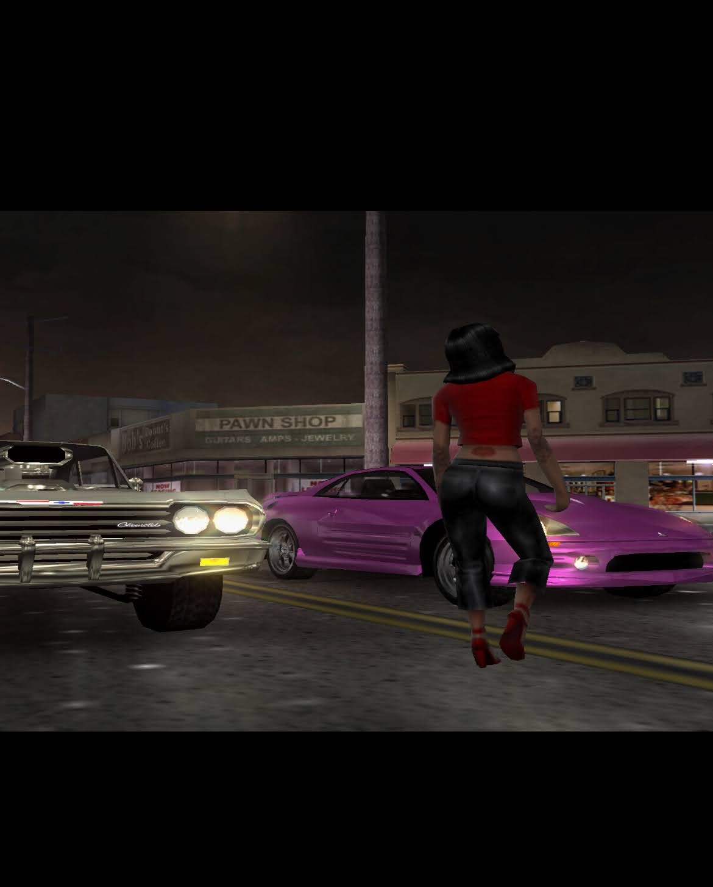
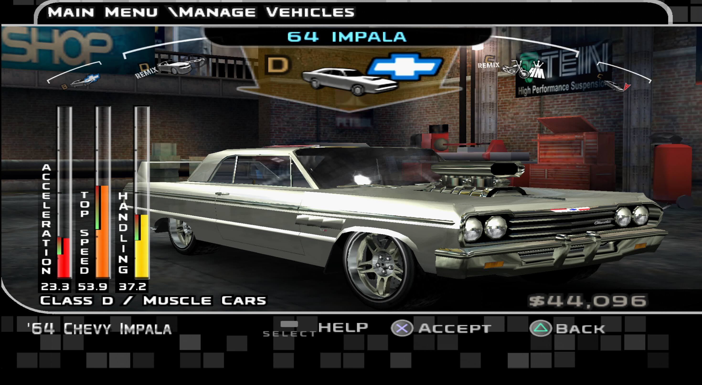

# Midnight Club 3 Save Editor

A reverse engineering project focused on understanding and manipulating the save format of **Midnight Club 3: DUB Edition Remix**.

The project started from a simple idea:
extracting a fully customized vehicle from one save and importing it into another.

First race of a new career (Rites of Passage).



Customized 1964 Chevrolet Impala extracted from the save.



---

## Available Commands

| Command       | Description                                       |
| ------------- | ------------------------------------------------- |
| `scan`        | Inspect garage slots and metadata.                |
| `export-slot` | Export a single vehicle.                          |
| `export-all`  | Export the complete garage.                       |
| `import-slot` | Replace or insert a vehicle into a specific slot. |
| `append`      | Add vehicles to the end of the visible garage.    |
| `import-all`  | Replace the entire garage using exported files.   |

---

## Usage

All features are currently available through the command-line interface.

```bash
python mc3_garage_tool.py <command> [arguments]
```

### Scan a save

Displays the garage structure, visible vehicles, occupied slots and basic information.

```bash
python mc3_garage_tool.py scan save.psu
```

---

### Export a single vehicle

Extracts one garage slot into an individual `.bin` file.

```bash
python mc3_garage_tool.py export-slot save.psu 0 vehicles/impala.bin
```

This is useful for creating a reusable vehicle library.

---

### Export the entire garage

Exports every garage slot into a folder.

```bash
python mc3_garage_tool.py export-all save.psu vehicles/
```

Each vehicle becomes an individual `.bin` file that can later be imported into another save.

---

### Import a vehicle into a specific slot

Replaces (or inserts) a vehicle into the selected garage slot.

```bash
python mc3_garage_tool.py import-slot save.psu vehicles/impala.bin 5 output.psu
```

The tool preserves the garage header automatically, making this the recommended import mode.

---

### Append vehicles to the garage

Adds one or more exported vehicles to the end of the visible garage without replacing existing cars.

```bash
python mc3_garage_tool.py append save.psu output.psu vehicles/impala.bin
```

You can also append an entire exported folder.

```bash
python mc3_garage_tool.py append save.psu output.psu vehicles/
```

---

### Import an entire garage

Replaces the complete garage using a previously exported folder.

```bash
python mc3_garage_tool.py import-all save.psu vehicles/ output.psu
```

---

## Typical Workflow

A common workflow looks like this:

1. Export your favorite vehicle from an existing save.
2. Store it in your personal vehicle library.
3. Start a new career or use another save.
4. Import or append the desired vehicles.
5. Generate a new `.psu` save.

This makes it possible to reuse customized vehicles across multiple careers without rebuilding them.

---

## Using the generated PSU

The tool never modifies your original save.

Instead, it creates a new `.psu` file containing the requested changes.

Before copying the new save to your memory card:

1. Create a backup of your original save.
2. Remove or rename the old save if necessary.
3. Copy the generated `.psu` to your PlayStation 2 memory card using **myMC**.
4. Launch the game and verify the imported vehicles.

Keeping a backup of the original save is strongly recommended during experimentation.

## Roadmap

The project is evolving in two main directions.

### Garage

- Expand vehicle editing.
- Map all vehicle properties.
- Improve import/export tools.

### Career

- Understand career progression.
- Identify progression flags.
- Document the complete save structure.
- Build a Career State Editor.

### Long-term

- Modular save editor.
- Public documentation.
- Automated reverse engineering tools.

---

## Project Status

The garage editing workflow is already functional and can be used to export, import and build reusable vehicle libraries.

The current focus of the project is reverse engineering.

As new discoveries are validated, they are documented first and then incorporated into the tool.

The editor is expected to grow naturally alongside the understanding of the save format, eventually becoming a modular toolkit capable of manipulating multiple systems within the Midnight Club 3 save game.

